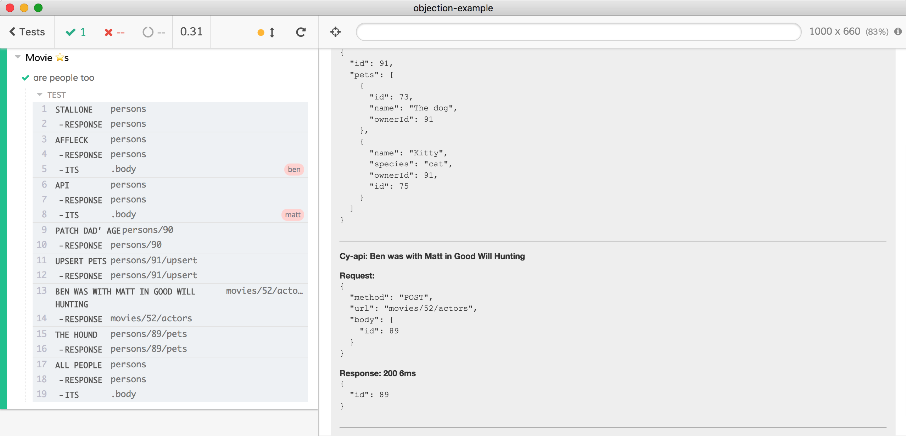

# objection-example [](https://circleci.com/gh/bahmutov/objection-example/tree/master)
> Simple Object.js ORM example copied from Vincit/objection.js

This example was copied from folder [examples/express-es7](https://github.com/Vincit/objection.js/tree/master/examples/express-es7) of [github.com/Vincit/objection.js](https://github.com/Vincit/objection.js)

The original client code that makes HTTP requests is in [client.js](client.js) but for this demo we are going to use [Cypress Test Runner](https://github.com/cypress-io/cypress) with [@bahmutov/cy-api](https://github.com/bahmutov/cy-api) plugin.



## Install

```shell
npm ci
```

## Run

To start local server and open Cypress

```shell
npm run dev
```

## Tests

TODO

## More info

- Read ["Black box API testing with server logs"](https://glebbahmutov.com/blog/api-testing-with-sever-logs/) post.
- see another example [server-logs-example](https://github.com/bahmutov/server-logs-example)
